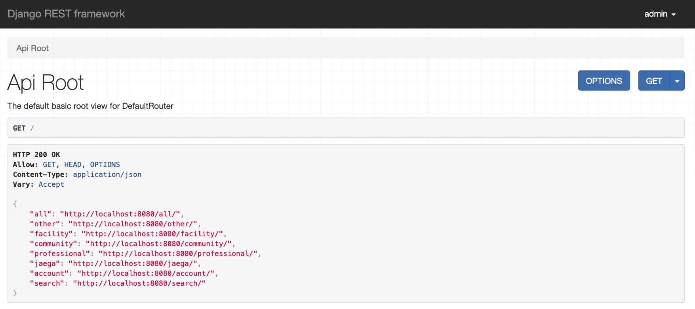

# 조은엽(Jo Eun Yeob)
## Motto

- 떨어지는 물방울이 바위를 뚫는다

## Contact
- Mail: naramharam@naver.com
- Github: https://github.com/joeunyeob

## Skills
- **Language**
  - Python3, 
- **Framework/Library**
  - Django, Django REST framework
- **Database**
  - PostgreSQL, SQLite3
- **Tool / DevOps**
  - Github
- **Environment**
  - Linux, Windows

## Experience
- [Wisoft](https://www.wisoft.io/)(2017. 03 ~ )

## Projects
### Cooperation
---
#### 딥러닝 기반 봉사활동 추천 시스템

- https://github.com/joeunyeob/DRF-API
- 기간: 2019.02 ~ 
- 개발언어: Python
- 툴: [PyCharm](https://www.jetbrains.com/pycharm/), [DataGrip](https://www.jetbrains.com/datagrip/)
- 주요 라이브러리: [Django](https://github.com/django/django),  [DRF](https://github.com/encode/django-rest-framework)
- 학습
  - BeautifulSoup4 , Selenium 을 활용하여 [1365자원봉사](https://www.1365.go.kr/vols/main.do), [VMS](https://www.vms.or.kr/main.do) 필요 데이터 크롤링
  - Server 와 PostgreSQL 연동 
  - [DRF Document](https://www.django-rest-framework.org/) 참고하여 학습
  - Back-End 와 Front-End 분업

### Personal

---
#### Totolist

## Education
- 한밭대학교 정보통신공학과 졸업예정(2012.03 ~ 2020.02)
  - 공군 (2013 ~ 2015)

## Hobby

- Baseball && Baseball
- Ping-pong
- Drive && Travel
